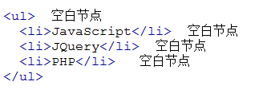

一些补充（不知道放在哪里、、、）：
1. `node.className`
2. `document.body.appendChild()`:访问body节点
3. `liNode.checked`:检查是否被选中(true)
4. `window.onload = function(){...}`


## 一、初识DOM
> 文档对象模型DOM（Document Object Model）定义访问和处理HTML文档的标准方法。DOM 将HTML文档呈现为带有元素、属性和文本的树结构（节点树）

1. 元素节点：上图中`<html>`、`<body>`、`<p>`等都是元素节点，即标签。
2. 文本节点:向用户展示的内容，如`<li>...</li>`中的JavaScript、DOM、CSS等文本。
3. 属性节点:元素属性，如`<a>标签的链接属性href="http://www.imooc.com"`。

## 二、获得节点

1. `getElementsByName("classname")`：有属性length，类似数组访问
2. `getElementsByTagName("tagname")`:有属性length，类似数组访问
3. `getElementById("id")`：根据id，所以一定只有一个

#### 获得/修改节点的属性值
- `node.getAttribute(name);`:直接`node.name`也可以
- `node.getAttribute(name,value);`：或者`node.name=value;`

## 三、节点属性

#### nodeName 属性: 节点的名称，是只读的。
    1. 元素节点的 nodeName 与标签名相同
    2. 属性节点的 nodeName 是属性的名称
    3. 文本节点的 nodeName 永远是 #text
    4. 文档节点的 nodeName 永远是 #document
#### nodeValue 属性：节点的值
    1. 元素节点的 nodeValue 是 undefined 或 null
    2. 文本节点的 nodeValue 是文本自身
    3. 属性节点的 nodeValue 是属性的值
#### nodeType 属性: 节点的类型，是只读的。以下常用的几种结点类型:
**如下所示：**

元素类型   | 节点类型
 - | -
元素       |   1
属性        |  2
文本        |  3
注释         | 8
文档        |  9

## 四、亲戚节点
### 1. 子节点
> `elementNode.childNodes`,返回的值可以看作是一个数组，他具有length属性。

**注意:**
1. IE全系列、firefox、chrome、opera、safari兼容问题
2. 节点之间的空白符，在firefox、chrome、opera、safari浏览器是文本节点，所以IE是3，其它浏览器是7，如下图所示:



### 2. 第一个/最后一个子节点
`node.firstChild/lastChild`

### 3. 父亲节点
`node.parentNode`

### 4. 兄弟节点
- 之前紧跟的节点:`node.previousSibling`
- 之后紧跟的节点:`node.nextSibling`

## 五、操作节点
### 1.创建元素节点和文本节点
- `createElement(tagName)`方法可创建元素节点。此方法可返回一个 Element 对象。
- `createTextNode(data)` 方法创建新的文本节点，返回新创建的 Text 节点：**也可以用`node.innerHTML`来代替**

### 2.插入节点
- `appendChild(newnode)`:在指定节点的最后一个子节点列表之后添加一个新的子节点.
- `insertBefore(newnode,node);`:方法可在已有的子节点前插入一个新的子节点。
    ```html
    <script type="text/javascript">

    var otest = document.getElementById("test");  
    var newnode = document.createElement("li");
    newnode.innerHTML = "php";
    
    otest.insertBefore(newnode,otest.lastChild);
    </script>
    ```
### 3.删除节点
`node.removeChild(node)`: 方法从子节点列表中删除某个节点。如删除成功，此方法可返回被删除的节点，如失败，则返回 NULL。

### 4.替换节点
- `node.replaceChild (newnode,oldnew )`:replaceChild 实现子节点(对象)的替换。返回被替换对象的引用。 
    ```html
    <script type="text/javascript">
        function replaceMessage(){
            var oldnode=document.getElementById("oldnode");
            var newnode=document.createElement("i");
            newnode.innerHTML=oldnode.innerHTML
            oldnode.parentNode.replaceChild(newnode,oldnode);
        }    
    </script>
    ```

<hr/>

## 六、实战

### 1. 增添表格
```html
<!DOCTYPE html>
<html>
 <head>
  <title> new document </title>  
  <meta http-equiv="Content-Type" content="text/html; charset=utf-8"/>   
  <script type="text/javascript"> 
	// 加载函数
    window.onload = function(){
          var tr=document.getElementsByTagName("tr");
          for(var i= 0;i<tr.length;i++)
          {
              bgcChange(tr[i]);
          }
     // 鼠标移动改变背景,可以通过给每行绑定鼠标移上事件和鼠标移除事件来改变所在行背景色。
      }         
	 function bgcChange(obj)
     {
		// 可以理解为node.attrName。毕竟obj是this传进来的
        obj.onmouseover=function(){
            obj.style.backgroundColor="#f2f2f2";
        }
        obj.onmouseout=function(){
            obj.style.backgroundColor="#fff";
        }
	 }
   
	 // 编写一个函数，供添加按钮调用，动态在表格的最后一行添加子节点；
     var num=2;
     function add(){
        num++;
        var tr=document.createElement("tr");
        var xh=document.createElement("td");
        var xm=document.createElement("td");
        xh.innerHTML="xh00"+num;
        xm.innerHTML="第"+num+"学生";
        var del=document.createElement("td");
        del.innerHTML="<a href='javascript:;' onclick='del(this)' >删除</a>";
        var tab=document.getElementById("table");
        tab.appendChild(tr);
        tr.appendChild(xh);
        tr.appendChild(xm);
        tr.appendChild(del);
        var tr = document.getElementsByTagName("tr");
          for(var i= 0;i<tr.length;i++)
          {
              bgcChange(tr[i]);
          }
     }
			
   	 
     // 创建删除函数
     function del(obj)
     {
         var tr=obj.parentNode.parentNode;
         tr.parentNode.removeChild(tr);
     }
  </script> 
 </head> 
 <body> 
	   <table border="1" width="50%" id="table">
	   <tr>
		<th>学号</th>
		<th>姓名</th>
		<th>操作</th>
	   </tr>  

	   <tr>
		<td>xh001</td>
		<td>王小明</td>
		<td><a href="javascript:;" onclick="del(this);">删除</a></td>   <!--在删除按钮上添加点击事件  -->
	   </tr>

	   <tr>
		<td>xh002</td>
		<td>刘小芳</td>
		<td><a href="javascript:;" onclick="del(this);">删除</a></td>   <!--在删除按钮上添加点击事件  -->
	   </tr>  

	   </table>
	   <input type="button" value="添加一行" onclick="add()" />   <!--在添加按钮上添加点击事件  -->
 </body>
</html>
```

### 2.切换页面

**HTML代码：**
```html
<!DOCTYPE html>
<html>
    <head>
        <meta charset="utf-8"/>
        <title>练习题</title>
        <link rel="stylesheet" href="css.css"/>
        <script type="text/javascript" src="js.js"></script>

    </head>
    <body>
        <div id="test">
            <ul>
                <li class="on">房产</li>
                <li>家居</li>
                <li>二手房</li>
            </ul>
            <div >
                275万购昌平邻铁三居 总价20万买一居<br>
                200万内购五环三居 140万安家东三环<br>
                北京首现零首付楼盘 53万购东5环50平<br>
                京楼盘直降5000 中信府 公园楼王现房<br>
            </div>
            <div class="hide">
                40平出租屋大改造 美少女的混搭小窝<br>
                经典清新简欧爱家 90平老房焕发新生<br>
                新中式的酷色温情 66平撞色活泼家居<br>
                瓷砖就像选好老婆 卫生间烟道的设计<br>
            </div>
            <div class="hide">
                    通州豪华3居260万 二环稀缺2居250w甩<br>
                    西3环通透2居290万 130万2居限量抢购<br>
                    黄城根小学学区仅260万 121平70万抛!<br>
                    独家别墅280万 苏州桥2居优惠价248万<br>
            </div>
        </div>
    </body>
</html>
```

**CSS代码**
```CSS
*{
    padding:0;
    margin: 0;
    font-size:15px;
    font-family:微软雅黑;
}

.hide{
    display: none;
}
#test{
    background: #EAE3E3;
    width:280px;
    height:150px;
    /*padding:5px;*/
    margin:15px;
}
#test ul {
    overflow: hidden;
    line-height: 20px;
    list-style: none;
}
#test ul li{
    font-size: 20px;
    cursor: pointer;
    float: left;;
    text-align: center;
    display: block;
    width:70px;
    padding:3px;
}

#test ul li.on{
    background: #D1DC77;
}
#test div{
    border-top:3px solid #D1DC77;
    line-height: 2em;
    clear: both;
}
```

**JS脚本代码**
```JavaScript
window.onload = function(){
    var test = document.getElementById("test");
    var li = test.getElementsByTagName("li");
    var div = test.getElementsByTagName("div");
    for(var i=0;i<li.length;++i){
        li[i].index = i;
        li[i].onmouseover = function(){
            for(var n=0;n<li.length;++n){
                li[n].className = "";
                div[n].className="hide";
            }
            this.className = "on";
            div[this.index].className = "";
        }
    }
}
```